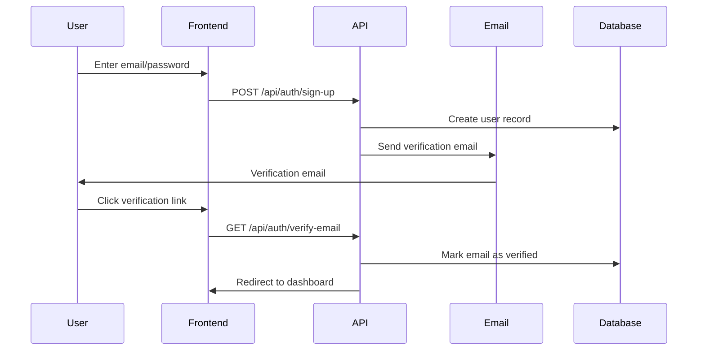
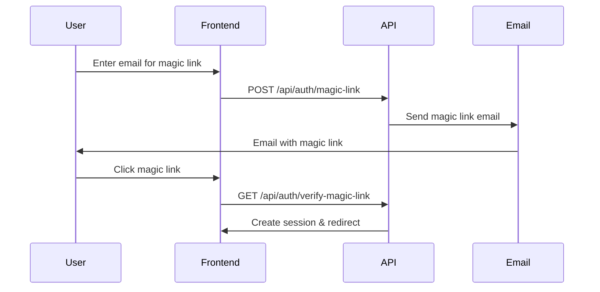
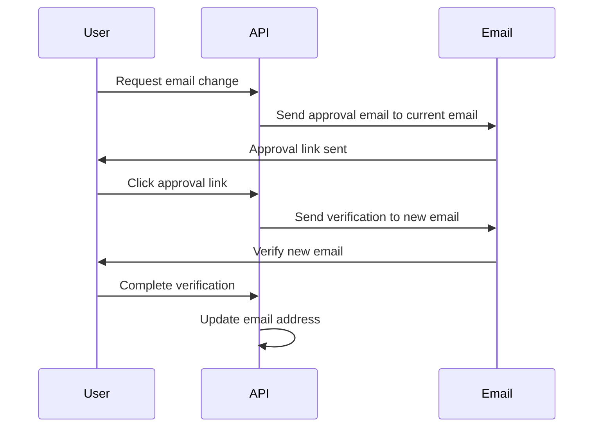

# Authentication Features & Flows

This document describes the comprehensive authentication system built with Better Auth in the Next.js boilerplate.

## Overview

The authentication system provides multiple sign-in methods, advanced security features, and seamless user management. Built on Better Auth with PostgreSQL and Prisma ORM.

## Authentication Methods

### 1. Email & Password Authentication

#### Features
- Secure password hashing with bcrypt
- Minimum password length validation (8 characters)
- Email verification required for new accounts
- Account linking across providers

#### Flow


#### Configuration
```typescript
emailAndPassword: {
  enabled: true,
  minPasswordLength: 8,
  autoSignIn: false,
  requireEmailVerification: false, // Handled via plugin
  sendResetPassword: async ({ user, url }) => {
    // Custom email sending logic
  }
}
```

### 2. Social Authentication

#### Supported Providers
- **Google OAuth 2.0** - Sign in with Google accounts
- **GitHub OAuth 2.0** - Sign in with GitHub accounts

#### Features
- Account linking and merging
- Profile information synchronization
- Trusted provider configuration
- Automatic user creation

#### Configuration
```typescript
socialProviders: {
  google: {
    prompt: "select_account",
    clientId: process.env.GOOGLE_CLIENT_ID!,
    clientSecret: process.env.GOOGLE_CLIENT_SECRET!,
  },
  github: {
    clientId: process.env.GITHUB_CLIENT_ID!,
    clientSecret: process.env.GITHUB_CLIENT_SECRET!,
  },
}
```

### 3. Magic Link Authentication

#### Features
- Passwordless authentication
- Secure token-based links
- Email delivery via Resend
- Configurable expiration (24 hours default)

#### Flow


### 4. OTP (One-Time Password) Authentication

#### Features
- Email-based OTP for sign-in
- 6-digit codes with 5-minute expiration
- Automatic registration for new users
- Configurable attempt limits

#### Configuration
```typescript
emailOTP: {
  otpLength: 6,
  expiresIn: 300, // 5 minutes
  allowedAttempts: 1,
  disableSignUp: true, // Auto-register users
}
```

### 5. Passkey Authentication (WebAuthn)

#### Features
- Modern passwordless authentication
- Hardware security key support
- Biometric authentication
- Cross-device synchronization

#### Configuration
```typescript
passkey: {
  rpID: "localhost", // Replace with your domain
  rpName: "Next Better Auth Boilerplate",
  origin: process.env.BETTER_AUTH_URL!,
}
```

## Security Features

### Two-Factor Authentication (2FA)

#### TOTP (Time-based One-Time Password)
- RFC 6238 compliant TOTP implementation
- 6-digit codes with 30-second windows
- QR code generation for authenticator apps

#### Email-based 2FA
- OTP sent via email as backup
- 6-digit codes with 5-minute expiration
- 3 allowed attempts per code

#### Configuration
```typescript
twoFactor: {
  totpOptions: {
    digits: 6,
  },
  otpOptions: {
    digits: 6,
    period: 300, // 5 minutes
    allowedAttempts: 3,
  }
}
```

### Session Management

#### Features
- Secure HTTP-only cookies
- Session caching (5-minute cache)
- IP address and User Agent tracking
- Automatic cleanup of expired sessions
- Active organization tracking

#### Configuration
```typescript
session: {
  cookieCache: {
    enabled: true,
    maxAge: 5 * 60, // 5 minutes
  },
}
```

### Account Security

#### Email Verification
- Required for new accounts
- 10-minute expiration window
- Secure token-based verification
- Auto-sign-in after verification

#### Password Reset
- Secure reset links via email
- 24-hour expiration
- One-time use tokens
- Rate limiting protection

#### Account Deletion
- User-initiated account deletion
- Cascade deletion of related data
- Email confirmation required

## User Management

### Profile Management

#### Features
- Update user name and profile image
- Change email with verification
- View account security settings
- Manage connected accounts

#### Email Change Flow


### Account Linking

#### Features
- Link multiple authentication providers
- Trusted provider configuration
- Automatic account merging
- Provider-specific settings

#### Configuration
```typescript
account: {
  accountLinking: {
    enabled: true,
    trustedProviders: [
      "google",
      "email-password",
      "github",
      "facebook",
      "apple",
    ],
  },
}
```

## Email Templates

The system includes customizable email templates for all authentication flows:

### Available Templates
- `email-verification.tsx` - Account activation
- `reset-password.tsx` - Password recovery
- `magic-link-login.tsx` - Passwordless authentication
- `2fa-otp-verification.tsx` - Two-factor codes
- `change-email-verification.tsx` - Email change confirmation
- `organization-invitation.tsx` - Team invitations
- `signin-otp-verification.tsx` - Sign-in OTP codes

### Template Features
- HTML and plain text versions
- Responsive design with Tailwind CSS
- Customizable branding and messaging
- React Email components

### Example Template Structure
```tsx
import { Html, Head, Body, Container, Text, Button } from "@react-email/components";

export function EmailVerification({ verificationUrl, expiresIn }) {
  return (
    <Html>
      <Head />
      <Body>
        <Container>
          <Text>Verify your email address</Text>
          <Button href={verificationUrl}>Verify Email</Button>
          <Text>This link expires in {expiresIn}</Text>
        </Container>
      </Body>
    </Html>
  );
}
```

## API Endpoints

### Authentication Endpoints
- `POST /api/auth/sign-up` - User registration
- `POST /api/auth/sign-in` - User login
- `POST /api/auth/sign-out` - User logout
- `GET /api/auth/session` - Get current session
- `POST /api/auth/verify-email` - Email verification
- `POST /api/auth/reset-password` - Password reset request
- `POST /api/auth/change-email` - Email change request

### Social OAuth Endpoints
- `GET /api/auth/callback/google` - Google OAuth callback
- `GET /api/auth/callback/github` - GitHub OAuth callback

### Advanced Auth Endpoints
- `POST /api/auth/magic-link` - Send magic link
- `POST /api/auth/verify-magic-link` - Verify magic link
- `POST /api/auth/enable-2fa` - Enable 2FA
- `POST /api/auth/verify-2fa` - Verify 2FA code
- `POST /api/auth/otp` - Send/sign-in with OTP

## Client-Side Integration

### Better Auth Client Setup
```typescript
import { createAuthClient } from "better-auth/client";

export const authClient = createAuthClient({
  baseURL: process.env.BETTER_AUTH_URL,
});
```

### Usage Examples

#### Sign Up
```typescript
await authClient.signUp.email({
  email: "user@example.com",
  password: "securepassword",
  name: "John Doe",
});
```

#### Sign In
```typescript
await authClient.signIn.email({
  email: "user@example.com",
  password: "securepassword",
});
```

#### Social Sign In
```typescript
await authClient.signIn.social({
  provider: "google",
});
```

#### Get Session
```typescript
const { data: session } = await authClient.getSession();
```

## Security Best Practices

### Environment Variables
- Use strong, unique secrets for `BETTER_AUTH_SECRET`
- Store sensitive credentials securely
- Use different credentials for development/production

### Rate Limiting
- Implement rate limiting on authentication endpoints
- Use CAPTCHA for suspicious activity
- Monitor for brute force attempts

### Session Security
- Use HTTPS in production
- Set secure cookie flags
- Implement session rotation
- Monitor for suspicious sessions

### Email Security
- Verify domain ownership in email providers
- Use SPF/DKIM/DMARC records
- Monitor email delivery and bounce rates

## Troubleshooting

### Common Issues

#### "Invalid credentials"
- Check email/password combination
- Verify email is confirmed
- Check for account lockouts

#### "Email not received"
- Check spam/junk folders
- Verify email address is correct
- Check email service configuration

#### "Session expired"
- Implement automatic session refresh
- Check cookie settings
- Verify token expiration times

#### "OAuth redirect errors"
- Verify callback URLs in provider settings
- Check client ID and secret
- Ensure HTTPS in production

### Debug Mode
Enable debug logging for development:

```typescript
const auth = betterAuth({
  // ... other config
  logger: {
    level: "debug",
    disabled: process.env.NODE_ENV === "production",
  },
});
```

## Advanced Configuration

### Custom Session Data
```typescript
customSession: async ({ user, session }) => {
  return {
    user,
    session,
    customData: {
      // Add custom session data
    },
  };
}
```

### Database Hooks
```typescript
databaseHooks: {
  user: {
    create: {
      before: async (user) => {
        // Pre-processing before user creation
        return { data: user };
      },
    },
  },
}
```

### Custom Redirects
```typescript
pages: {
  signIn: {
    route: "/auth/signin",
    redirectTo: "/dashboard",
  },
  error: {
    route: "/auth/error",
  },
}
```

This authentication system provides enterprise-grade security while maintaining developer-friendly APIs and comprehensive user management features.
